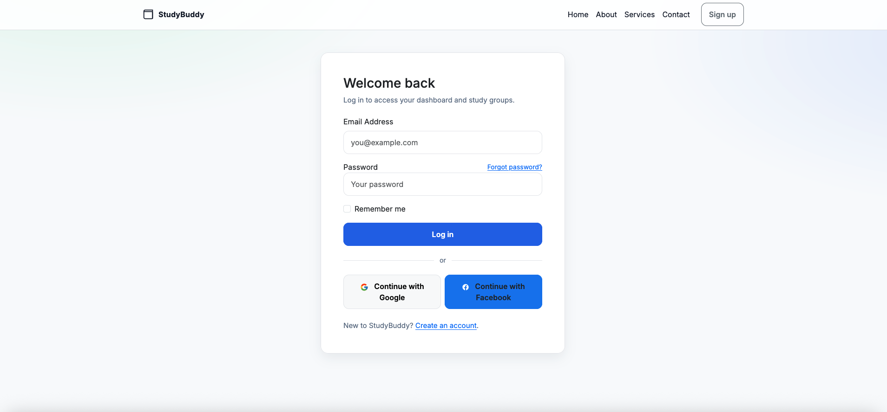
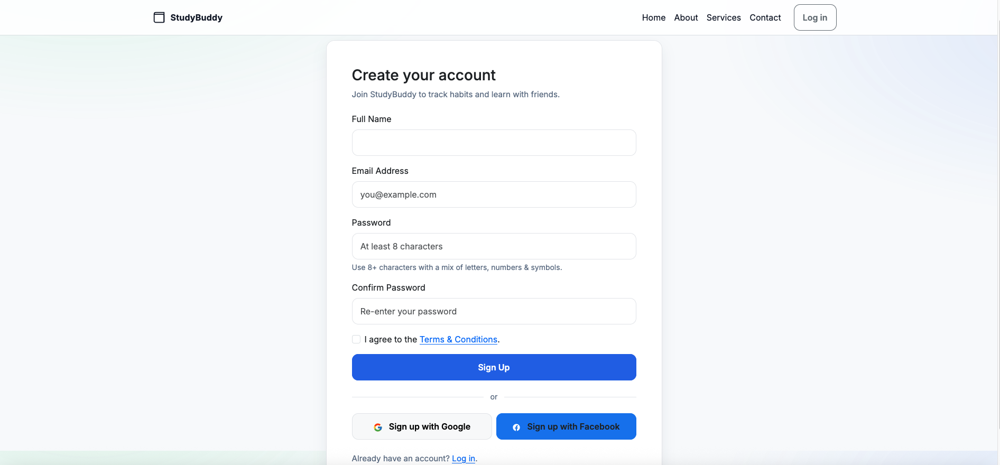

# 👷 UNDER CONSTRUCTION 🚧

📒 Follow the build journal here: [StudyBuddy Application Project Tracking Notes](https://docs.google.com/document/d/1EhhgQm3zqiUPaV7JSrARes0dfj84W4hXUaf68w_S3yo/edit?usp=sharing)

````markdown
# 📚 StudyBuddy – Collaborative Study Planner & Habit Tracker

**StudyBuddy** is a full-stack web application designed to help students and self-learners stay consistent by forming study habits, tracking progress, and collaborating in study groups.

---

## 🚀 Overview

Many learners struggle with consistency and motivation. **StudyBuddy** tackles this by combining:

- ✅ Daily habit tracking
- 👥 Study group collaboration
- 🗓️ Shared calendars for study sessions
- 📊 Progress dashboards
- 🔐 Role-based secure access

Built using **Spring Boot**, **Thymeleaf**, and **PostgreSQL**, the app demonstrates full-stack development, real-world data modeling, and collaborative features.

---

## 🔧 Tech Stack

| Layer        | Tech                                    |
|--------------|-----------------------------------------|
| Language     | Java 11                                 |
| Backend      | Java, Spring Boot, Spring Security, JPA |
| Frontend     | Thymeleaf, Alpine.js, Bootstrap         |
| Database     | PostgreSQL                              |
| Deployment   | Render / Railway (planned)              |
| Testing      | JUnit, Mockito                          |
| Tools        | Docker, Docker Compose                  |
| Documentation| Google Docs, Google Sheets              |
| CI/CD        | GitHub Actions                          |
| Version Control | GitHub                               |
|-----------------|--------------------------------------|

## ✨ Key Features (MVP)

- 🔐 User authentication with roles (admin/member)
- 👥 Create and join study groups
- ✅ Habit tracking with streak history
- 📅 Group calendars with scheduled sessions
- 📊 Dashboards for individual and group progress
- 🔔 Reminder system (planned)

---

## 📁 Project Structure (WIP)

```
studybuddy/
├── src/
│   ├── main/
│   │   ├── java/com/studybuddy/
│   │   │   ├── controller/
│   │   │   ├── entity/
│   │   │   ├── repository/
│   │   │   ├── service/
│   │   ├── resources/
│   │   │   ├── templates/  # Thymeleaf views
│   │   │   ├── static/     # CSS, JS
│   │   │   └── application.properties
└── README.md
````
```
studybuddy/
├── db/
│   └── init/
│       ├── studybuddy_postgresql_schema.sql
│       └── studybuddy_seed_data.sql
├── src/
│   └── main/
│       └── resources/
│           └── application-dev.properties
├── docker-compose.yml
└── ...

```
---

## 🏗️ How to Run Locally

1. **Clone the repository**

   ```bash
   git clone https://github.com/yourusername/studybuddy.git
   cd studybuddy
   ```

2. **Set up your database**

   * Create a PostgreSQL database named `studybuddy`
   * Update your `application.properties`:

     ```properties
     spring.datasource.url=jdbc:postgresql://localhost:5432/studybuddy
     spring.datasource.username=yourusername
     spring.datasource.password=yourpassword
     ```

3. **Run the app**

   ```bash
   ./mvnw spring-boot:run
   ```

4. **Visit**: `http://localhost:8080`

---

## 🧠 Documentation & Planning

* [x] Week 0 – Project Setup & ERD
* [x] Week 1 – Auth + User Roles
* [ ] Week 2 – Study Groups
* [ ] Week 3 – Habit Tracker
* [ ] Week 4 – Shared Calendar
* [ ] Week 5 – Dashboards & Polish
* [ ] Week 6 – Testing & Deployment

---

## 📸 Screenshots 

### - Login 



### - Signup




*Will add UI screenshots or wireframes as the app evolves.*
---

## 🌐 Live Demo (Coming Soon)

> 🚧 Deployed via Render/Railway: **\[Link TBD]**

---

## 🧪 Testing

Basic unit tests with JUnit and Mockito:

```bash
./mvnw test
```

---

## 🤝 Contributing

This is a personal learning project, but feel free to fork and build on it.

---

## 📄 License

MIT License — feel free to use and modify.

---

## 🙋‍♂️ Author

**Your Name** – [@yourhandle](https://github.com/yourhandle)
Project inspired by personal study struggles and tools like Habitica, Notion, and StudyTogether.

```

